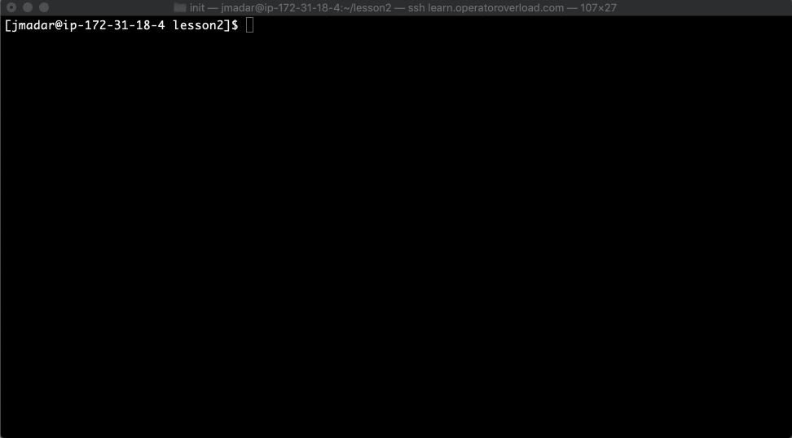
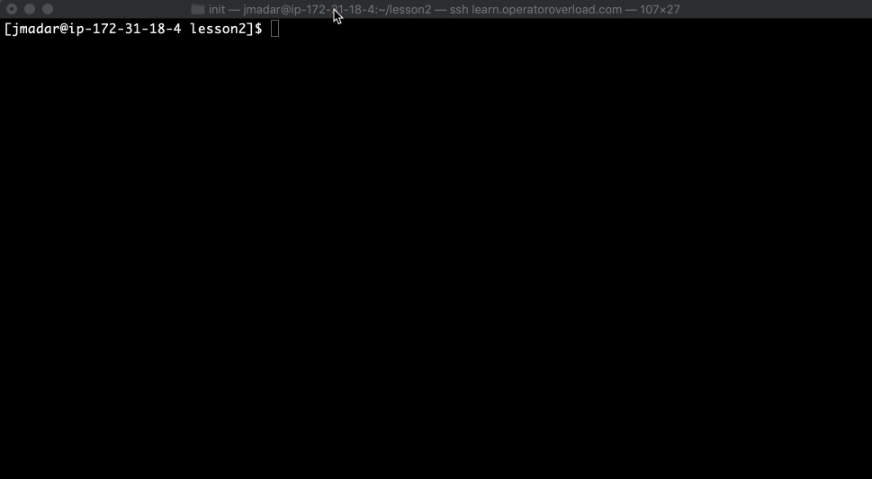
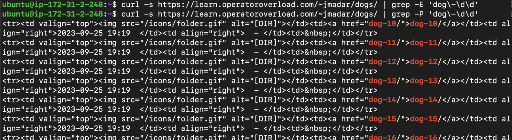
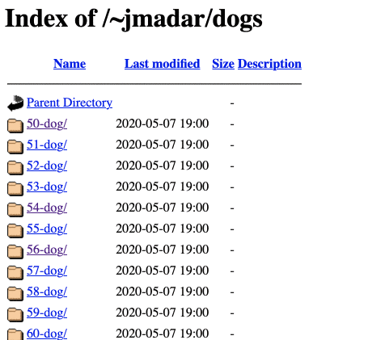
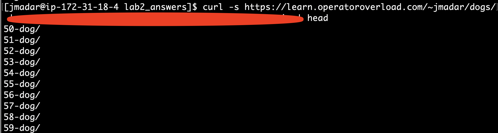
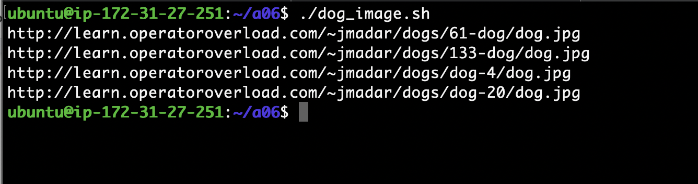
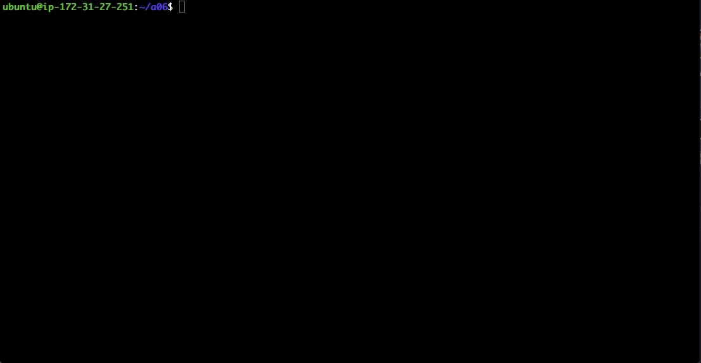
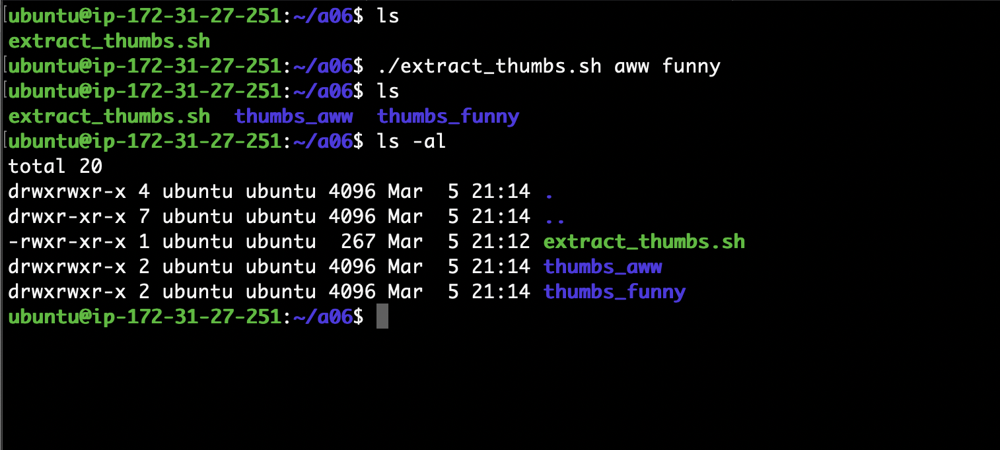
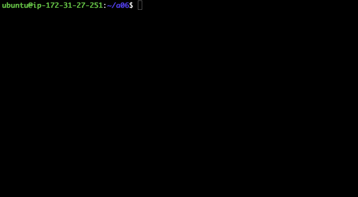

# Linux Bash Scripting

Watch Chapter 2 and 3: https://www.linkedin.com/learning/learning-bash-scripting-17063287 

Let’s say if I want to download all the images from the langara website that we retrieved
from the previous section, we can run the wget command  on every file above, like this: 



I got tired typing after 2 downloads, lol.

There is a better way, basically we want to run the command:

```
curl -s https://langara.ca | grep -o -E '/_files.*jpg'
```

We store the output into an array variable, then we want to run wget on every item of the array.
This is how we can do it via a shell script, a program that uses shell commands.
Here is the code:

```
# Stores the output into the array call FILES
# NOTE: we use command substitution $( ) to capture the 
# output of a command into a variable
FILES=$(curl -s https://langara.ca | grep -o -E '/_files.*jpg')

# Loop over the FILES array.  In bash, assigning we need
# to prefix a variable with the $ sign to access its content
for F in $FILES
do
    # we are inside the loop, and we can now run wget on
    # the $F variable.  Noticed the use of variable expansion ${}
    wget https://langara.ca${F}
done
```

Save this in a file called download.sh and we can run it using the command

```
bash download.sh
```

To make the file easier to run, we can make the file executable.  To do this,
we need to first add a line in the beginning of the file to indicate to Linux
that this file requires the bash program.
This is generally called the **shebang** line:

```
#!/bin/bash

# Stores the output into the array call FILES
# NOTE: we use command substitution $( ) to capture the 
# output of a command into a variable
FILES=$(curl -s https://langara.ca | grep -o -E '/_files.*jpg')

# Loop over the FILES array.  In bash, assigning we need
# to prefix a variable with the $ sign to access its content
for F in $FILES
do
    # we are inside the loop, and we can now run wget on
    # the $F variable.  Noticed the use of variable expansion ${}
    wget https://langara.ca${F}
done
```

We then change the permission of the file so it is executable by Linux,
finally we can run it on the command line:



Notice that we have to provide the path to the current directory when calling the script
file.

# Notes

1. Use the -P option of grep if you want to use the standard regex that you learned last week.
i.e.



2. If you would like to have syntax highlighting on your bash terminal, copy the following 2
files from my home directory to yours, then exit and re-login:

```
cp /home/jmadar/.bashrc ${HOME}
cp /home/jmadar/.profile ${HOME}
```

3. A reminder that to make your script file executable, you need to do the following:

  - Add the `#!/bin/bash` line as the first line of your script
  - Run `chmod +x ${script_filename}` to give the file executable permission
  - Execute the file by calling it directly (with path), i.e.
  ```
  ./${script_filename}
  ```

# Question 1

Follow the instructions above to create **`downloads.sh`**.

# Question 2

In data gathering, sometimes we need to extract information from web pages,
directory listings, etc.

Visit https://learn.operatoroverload.com/~jmadar/dogs/ 

Some of the items have names like XXX-dog while others are dog-XXX (where XXX is a number).  

Some directories have actual dog images in them, but most don’t.  In the animated gif below,
I tried to click on each of the directories to find a directory containing the file dog.jpg.
Turns out one of the directory is 61-dog/:



Your goal is to write a script to output the URL to all the dog.jpg locations
under https://learn.operatoroverload.com/~jmadar/dogs/

<ol type="a">

<li> Write a bash one-liner to extract all the directory names 
Hint: you will need to combine **curl**, **grep**, and **regex**
to accomplish this.



NOTE: In the above screenshot, I have blurred out the important part of the
one-liner, and added a head command so the output would fit the screenshot.
Your one-liner will NOT include the head command.

**Put this one-liner in a file called `q2a.txt`**
</li>

<li>
Incorporate your one liner into a script call *dog_image.sh* that outputs
to stdout the urls all directories with images, as follows:



**Call this script `dog_image.sh`**
</li>

</ol>

## HINTS

Since there are no inputs, you don’t have to do any error checking on the input.
You can also assume that the url http://learn.operatoroverload.com/~jmadar/dogs/
will always be available. 

If you are trying to figure out how to check if a file exists on a web server
using curl, here's an article that may help:
https://matthewsetter.com/check-if-file-is-available-with-curl/

Below is a code snippet that outputs 'ok' if a particular webpage exists on
langara.ca using the technique described in the above article

```
CODE=$(curl -o /dev/null --silent -Iw '%{http_code}' https://langara.ca/programs-and-courses/index.html)
if [[ $CODE == '200' ]]
then
    echo 'ok'
fi
```

# Question 3

Regex is great because of the ability to extract information from unstructured sources
(instead of relying on delimiters). To demonstrate, write a script that extracts all
thumbnail images from a particular subreddit.

<ol type='a'>

<li>
Come up with a bash one-liner that extracts all the image URLs from
https://www.reddit.com/r/aww.json where the URLs starts with
https://i.redd.it/ and ends with png, jpg, or gif.  For example, the
following is a partial result of my output:

```
https://i.redd.it/6aic0hoye0x41.jpg
https://i.redd.it/award_images/t5_22cerq/12kz7a7j4v541_HeartEyes.png
https://i.redd.it/award_images/t5_22cerq/n94bgm83in941_ItsCute.png
https://i.redd.it/award_images/t5_22cerq/5izbv4fn0md41_Wholesome.png
https://i.redd.it/award_images/t5_22cerq/vu6om0xnb7e41_This.png
https://i.redd.it/award_images/t5_22cerq/ineip651cuw41_GuacMyWorld.png
https://i.redd.it/5alm7ti5tzw41.jpg
https://i.redd.it/mphydrmgkzw41.jpg
```

Put this one-liner into the file **`q3a.txt`**
</li>

<li>
Create a script file called **`extract_thumbs.sh`** that takes a subreddit
as an argument.  Running ./extract_thumbs.sh aww will save all thumbnails
(i.e. the JSON key being "thumbnail") from the https://www.reddit.com/r/aww.json
into the subdirectory thumbs_aww/


</li>

<li>
Modify your script to handle multiple command line arguments, as below:

Here’s how you can process multiple arguments:
https://www.baeldung.com/linux/use-command-line-arguments-in-bash-script#loop-construct 


</li>

</ol>

# Question 4

When visiting a website, sometimes you will be asked for a user-id and
password combo.  The website that we will be using in this exercise is
https://learn.operatoroverload.com/~jmadar/protected/index.html.
If you visit it with a browser, you will be prompted for proper credentials
via a dialog box, as follows:


The above interaction can be done via curl:


Pay special attention to how username and passwords are included in the url.
The username for our targeted website will always be www-user, but the
password is randomly chosen from the first 100 lines in this file:
https://raw.githubusercontent.com/danielmiessler/SecLists/master/Passwords/Common-Credentials/10k-most-common.txt 

Write a script **`brute_force.sh`** that extracts the message enclosed inside the
<h1> tag from the password protected page and outputs it to stdout.  The
script will accomplish this by trying the 100 potential passwords, one at a time.  



## HINTS

The secret message is different from the screen caps shown in the lab write-up.
After all, it's a "secret message".  So the most effective way to detect if you
got the secret message is to test for the ABSENCE of the string '401 Unauthorized"
in the output.

# Hand-in

If you completed the entire assignment, you will have the following files
in your assignment directory:

- download.sh
- q2a.txt
- dog_image.sh
- q3a.txt
- extract_thumbs.sh
- brute_force.sh

Make sure you run `pytest` to check your score.

Once you are satisified with your score, run the following commands to submit your assignment:

1. `git add -A`
2. `git commit -a -m 'submit'`
3. `git push`
