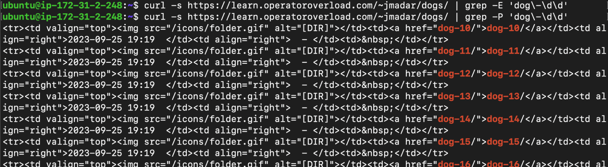
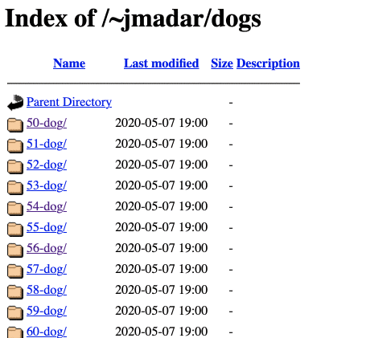
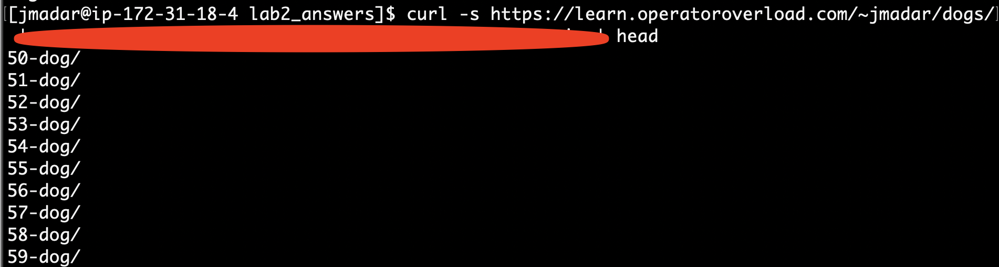
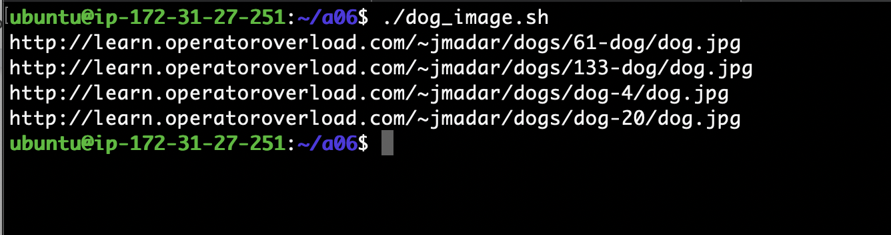

# Pre-reading

  + https://www.linkedin.com/learning/learning-linux-command-line-26594217/search-for-text-in-files-and-streams-with-grep 

  + https://www.linkedin.com/learning/learning-linux-command-line-26594217/manipulate-text-with-awk-sed-and-sort 

  + Chapters 2 and 3: https://www.linkedin.com/learning/learning-bash-scripting-26210777 

# Linux Bash Scripting 

Let's say I want to output all the jpg images from the Capilano University website, I could
use the following one-liner with a combination of curl and grep, as follows:

```
# Download the homepage HTML (-s for silent), extract all .jpg image paths with grep, and sort them uniquely
curl -s https://www.capilanou.ca | grep -o -E '/media.*jpg' | sort -u
```

Below is the sample output from the shell:

```shell
$ curl -s https://www.capilanou.ca | grep -o -E '/media.*jpg' | sort -u
/media/capilanouca/about-capu/get-to-know-us/capsule-stories/images/CapU-Student-First-Week-feature-image-1-800x495.jpg
/media/capilanouca/about-capu/get-to-know-us/capsule-stories/images/CapU-Student-First-Week-feature-image-500x309.jpg
/media/capilanouca/about-capu/get-to-know-us/capsule-stories/images/North-Shore-feature-image-1-800x495.jpg
/media/capilanouca/about-capu/get-to-know-us/capsule-stories/images/North-Shore-feature-image-500x309.jpg
/media/capilanouca/about-capu/get-to-know-us/capsule-stories/images/Sarah-Buchanan-feature-image-1-800x495.jpg
/media/capilanouca/about-capu/get-to-know-us/capsule-stories/images/Sarah-Buchanan-feature-image-500x309.jpg
/media/capilanouca/about-capu/get-to-know-us/capsule-stories/images/The-Mace-feature-image-1-800x495.jpg
/media/capilanouca/about-capu/get-to-know-us/capsule-stories/images/The-Mace-feature-image-500x309.jpg
/media/capilanouca/about-capu/get-to-know-us/capsule-stories/images/capu-in-focus-feature-photo-1-800x495.jpg
/media/capilanouca/about-capu/get-to-know-us/capsule-stories/images/capu-in-focus-feature-photo-500x309.jpg
/media/capilanouca/about-capu/get-to-know-us/events/university-events/2024.10.15_Learning-Support_13.jpg
/media/capilanouca/about-capu/get-to-know-us/events/university-events/2025.3.6_MDX-Student-Lifestyle_121_Event_page_Main_image_800x495.jpg
/media/capilanouca/about-capu/get-to-know-us/events/university-events/Consent-Coffee-Chat-image.jpg
/media/capilanouca/images/explore-degrees/Business-and-Professional-Studies-feature.jpg
/media/capilanouca/images/explore-degrees/Education-Health-and-Human-Development-feature.jpg
/media/capilanouca/images/explore-degrees/Global-and-Community-Studies-feature.jpg
/media/capilanouca/images/homepage-hero/homepage-hero-September-2024.jpg
/media/capilanouca/programs-amp-courses/search-amp-select/program-profiles/idea-instructor-painting.jpg
```

Now let's download every single image from the above, we can use the `wget` command, as follows:

```
wget https://www.capilanou.ca/media/capilanouca/about-capu/get-to-know-us/capsule-stories/images/CapU-Student-First-Week-feature-image-1-800x495.jpg
wget /media/capilanouca/about-capu/get-to-know-us/capsule-stories/images/CapU-Student-First-Week-feature-image-500x309.jpg
# ... do the above for each of the url above
```

I don't know about you, but I would get tired typing after 2 downloads, lol.

There is a better way, logically, we want to store the output of the first command 
into an list, then run wget on each of the item on the list, appending `https://www.capilanou.ca/`
to the beginning. 

We do it via a shell script, a program that uses shell commands.
Here is the code:

```bash
# Stores the output into the array call FILES
# NOTE: we use command substitution $( ) to capture the 
# output of a command into a variable
FILES=$(curl -s https://www.capilanou.ca | grep -o -E '/media.*jpg')

# Loop over the FILES array.  In bash, assigning we need
# to prefix a variable with the $ sign to access its content
for F in $FILES
do
    # we are inside the loop, and we can now run wget on
    # the $F variable.  Noticed the use of variable expansion ${}
    wget https://www.capilanou.ca${F}
done
```

Save this in a file called download.sh and we can run it using the command

```
bash download.sh
```

To make the file easier to run, we can make the file executable.  To do this,
we need to first add a line in the beginning of the file to indicate to Linux
that this file requires the bash program.
This is generally called the **shebang** line:

```
#!/bin/bash

# Stores the output into the array call FILES
# NOTE: we use command substitution $( ) to capture the 
# output of a command into a variable
FILES=$(curl -s https://www.capilanou.ca | grep -o -E '/media.*jpg')

# Loop over the FILES array.  In bash, assigning we need
# to prefix a variable with the $ sign to access its content
for F in $FILES
do
    # we are inside the loop, and we can now run wget on
    # the $F variable.  Noticed the use of variable expansion ${}
    wget https://www.capilanou.ca${F}
done
```

We then change the permission of the file so it is executable by Linux,
finally we can run it on the command line:

```shell
$ chmod +x download.sh
```

Then you can run the script with the following directly in the shell as follows:

```shell
$ ./download.sh
```


Notice that we have to provide the path to the current directory when calling the script
file.

# Notes

1. Use the -P option of grep if you want to use the standard regex that you learned last week.
i.e.



2. If you would like to have syntax highlighting on your bash terminal, copy the following 2
files from my home directory to yours, then exit and re-login:

```
cp /home/env3d/{.bashrc,.profile} ${HOME}
```

3. A reminder that to make your script file executable, you need to do the following:

  - Add the `#!/bin/bash` line as the first line of your script
  - Run `chmod +x ${script_filename}` to give the file executable permission
  - Execute the file by calling it directly (with path), i.e.
  ```
  ./${script_filename}
  ```

# Question 1

Follow the instructions above to create **`download.sh`**.

# Question 2

In data gathering, sometimes we need to extract information from web pages,
directory listings, etc.

Visit https://learn.operatoroverload.com/~jmadar/dogs/ 

Some of the items have names like XXX-dog while others are dog-XXX (where XXX is a number).  

Some directories have actual dog images in them, but most don’t.  In the animated gif below,
I tried to click on each of the directories to find a directory containing the file dog.jpg.
Turns out one of the directory is 61-dog/:



Your goal is to write a script to output the URL to all the dog.jpg locations
under https://learn.operatoroverload.com/~jmadar/dogs/

<ol type="a">

<li> Write a bash one-liner to extract all the directory names 
Hint: you will need to combine curl, grep, and regex
to accomplish this.



NOTE: In the above screenshot, I have blurred out the important part of the
one-liner, and added a head command so the output would fit the screenshot.
Your one-liner will NOT include the head command.

**Put this one-liner in a file called `q2a.txt`**
</li>

<li>
Incorporate your one liner into a script call *dog_image.sh* that outputs
to stdout the urls all directories with images, as follows:



**Call this script `dog_image.sh`**
</li>

</ol>

## HINTS

Since there are no inputs, you don’t have to do any error checking on the input.
You can also assume that the url http://learn.operatoroverload.com/~jmadar/dogs/
will always be available. 

If you are trying to figure out how to check if a file exists on a web server
using curl, here's an article that may help:
https://matthewsetter.com/check-if-file-is-available-with-curl/

Below is a code snippet that outputs 'ok' if a particular url exists on
using the technique described in the above article

```
CODE=$(curl -o /dev/null --silent -Iw '%{http_code}' https://www.capilanou.ca/favicon.ico)
if [[ $CODE == '200' ]]
then
    echo 'ok'
fi
```

# Hand-in

If you completed the entire assignment, you will have the following files
in your assignment directory:

- download.sh
- q2a.txt
- dog_image.sh

Make sure you run `pytest` to check your score.

Once you are satisified with your score, run the following commands to submit your assignment:

1. `git add -A`
2. `git commit -a -m 'submit'`
3. `git push`
